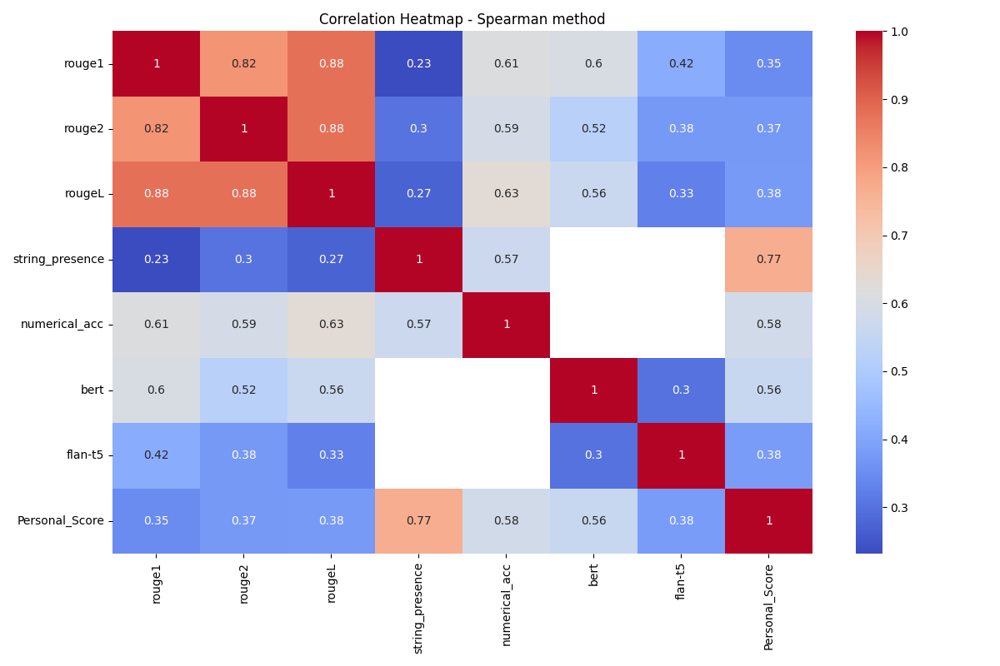
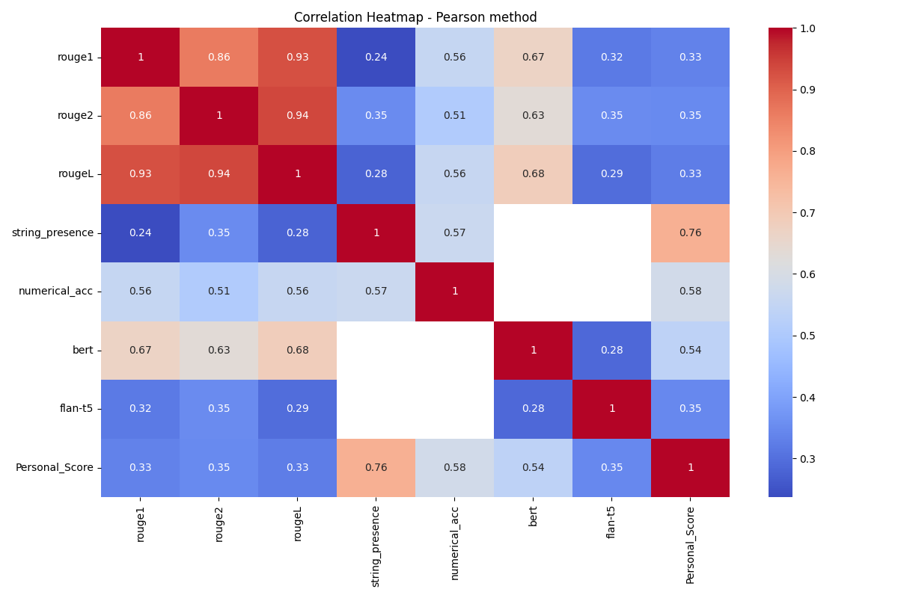
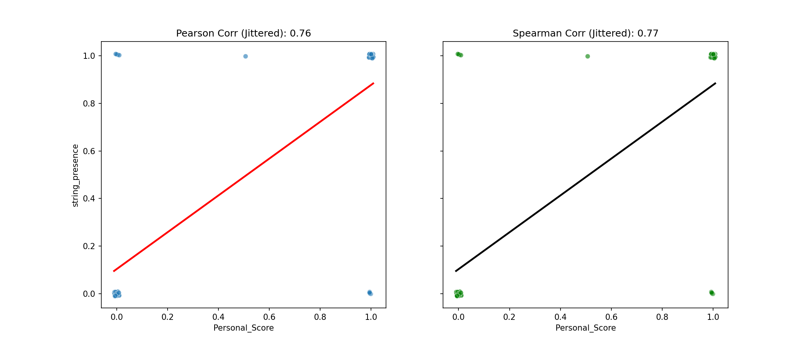

# OpenFinanceAI


Open-source project focused on developing a generative AI agent for financial analysis and responsible investment recommendations.

---

[[Dataset]](https://huggingface.co/datasets/artefactory/Argimi-Ardian-Finance-10k-text)

## Table of Contents
- [Overview](#openfinanceai)
- [Project Structure](#project-structure)
- [Usage Instructions](#usage-instructions)
- [Output Files Explained](#output-files-explained)
- [Problems](#actual-problems)
- [Next Steps](#future-directions)
- [Authors](#authors) 

## Project Structure

```plaintext
OpenFinanceAI/

├── Assets/                         
│   ├── comptes_rendus/             
│   ├── data/                           
│   ├── data_test/                        # Smaller dataset to run to test PDFs
│       ├── ardian_dataset_test.csv       # CSV file for analyzing pipeline performance
│   ├── Images/                
│   ├── output/                           # Directory for generated results
│       ├── FinQA/                        # Directory for FinQA evaluation results
│           ├── InternVL2_5MPO/           # Results for InternVL2_5-8B-MPO model
│           ├── Qwen2_5VL/                # Results for Qwen2_5VL model
│           ├── Qwen2VL/                  # Results for Qwen2VL model
│           └── evaluation_results.txt    # Final comparison results
│        ├── relevant_documents/          # Stores the top-K most relevant document images
│        ├── similarity_maps/             # Stores similarity map visualizations
│        ├── generated_responses.txt      # Final generated responses
│        ├── similarity_scores.txt        # Similarity scores for each token and document
│   ├── Presentations/      
│   ├── report/      
├── scripts/ 
│   ├── Colpali_InternVL2.5.py            # Main script to process PDFs and generate responses with InternVL2_5-78B-MPO (CUDA out of memory)
│   ├── Colpali_Qwen_ResponsePerPage.py   # Alternate script for per-page responses (under testing)
│   ├── Colpali_Qwen.py                   # Main script to process PDFs and generate responses with Qwen2-VL-2B-Instruct
│   ├── Colpali_Qwen_2_5.py               # Main script to process PDFs and generate responses with Qwen/Qwen2.5-VL-7B-Instruct
│   └── eval_finqa.py                     # Evaluating the Visual Language Model                     
├── streamlit/                            # Directory containing Streamlit application
│   ├── output/                           # Output folder for Streamlit results
│   ├── temp_files/                       # Temporary files generated during Streamlit execution
│   ├── uploaded_pdfs/                    # Uploaded PDFs from Streamlit app
│   ├── ardian_dataset_test.csv           # CSV file for analyzing pipeline performance
│   └── app.py                            # Streamlit Application (CUDA out of memory)
├── README.md                             # Project documentation
└── requirements.txt                      # Python dependencies
```

## Usage Instructions

### GPU Access
To request a GPU session:
```bash
srun -p gpu_inter -t 00:30:00 --pty bash
```
To request a specific GPU node:

```bash
srun -p gpu_inter -t 00:30:00 --nodelist=sh03 --pty bash
```

Execute the main script as follows

```bash
python Colpali_Qwen2_5.py
```

### Retriever Evaluation

To evaluate the retrievers, we followed the official instructions provided in the [Vidore Benchmark Retriever README](https://github.com/illuin-tech/vidore-benchmark/blob/main/src/vidore_benchmark/retrievers/README.md). 

1. Install the required package:
   ```bash
   pip install "vidore-benchmark[all-retrievers]"
   ```
2. Ensure all necessary files are saved manually, as automatic saving is not handled by the process.
3. Install the package in editable mode:
   ```bash
   pip install -e .
   ```
4. Execute the retriever evaluation command:
   ```bash
   vidore-benchmark evaluate-retriever \
       --model-class colqwen2_personal \
       --model-name vidore/colqwen2-v1.0 \
       --dataset-name vidore/docvqa_test_subsampled \
       --split test
   ```

### FinQA Evaluation

In addition to evaluating the retriever, we also assess our model’s performance using [FinQA](https://finqasite.github.io/), which focuses on evaluating the Visual Language Model (VLM) directly rather than retrieval effectiveness. 

1. **Load the dataset** containing questions, answers, and associated PDF documents.
2. **Run the model** on the dataset without retrieval, directly processing the PDF input.
3. **Assess the generated answers** qualitatively to ensure coherence and accuracy.

Since FinQA does not rely on retrieval metrics, the objective is to verify if the model generates meaningful and contextually correct responses from the provided PDFs. This evaluation complements the retriever assessment by testing the end-to-end question-answering capability of our system.


### File Management
Use [WinSCP](https://winscp.net/eng/download.php) for file transfer between local and remote systems.

## Output Files Explained

The output directory contains the following key files and folders:

1. **`relevant_documents/`**
   - **Description**: Contains the top-K most relevant images extracted from the input PDF.
   - **Details**: These images are determined based on similarity scores with the provided query.

2. **`similarity_maps/`**
   - **Description**: Contains visualizations of token similarity maps.
   - **Details**: Each map highlights the most relevant areas of a document for each token in the query.

3. **`generated_responses.txt`**
   - **Description**: A text file containing the final generated responses based on the query.
   - **Details**: Combines information from all top-K relevant images to produce a single, coherent answer.

4. **`similarity_scores.txt`**
   - **Description**: A detailed log of similarity scores for each token in the query and the corresponding document sections.
   - **Format**:
     ```plaintext
     Document 1, Token #1 (`<bos>`): MaxSim score = 0.28
     Document 1, Token #2 (`Query`): MaxSim score = 0.24
     ...
     ```

5. **`FinQA/`**
   - **Description**: Contains the results of the FinQA evaluation.
   - **Details**: This directory includes subfolders with a prompt, target, and generated answer for each sample and for each model evaluated, as well as a final comparison results file.
   - **Subfolders**:
     - **`Qwen2VL/`**: Contains the results for the Qwen2VL model.
     - **`Qwen2_5VL/`**: Contains the results for the Qwen2_5VL model.
     - **`evaluation_results.txt`**: Final comparison results of the models' accuracy.

## Metrics for Evaluation

To evaluate the performance of our models, we use a combination of automatic metrics and ranking methods. These metrics help us assess the quality of generated responses and compare different models effectively.

### Retriever

We evaluated our personal retriever on the ViDoRe benchmark as stated above in order to confirm the results obtained in the orignial paper.

Furthermore, we are using 4 metrics to evaluate its performance with our datatset of questions:

#### MMR (Mean Reciprocal Rank)
- Measures the effectiveness of the retriever in returning relevant documents at the top of the ranked list.
- Calculated as the reciprocal of the rank of the first relevant document.
- Higher values indicate better performance (range: 0-1).

#### Precision at 1
- Measures the relevance of the top retrieved document.
- Calculated as the proportion of relevant documents among the first retrieved document.
- Higher values indicate better precision (range: 0-1).

#### Recall at 3
- Measures the ability of the retriever to find all relevant documents among the top 3 retrieved.
- Calculated as the proportion of relevant documents found among the top 3 retrieved.
- Higher values indicate better recall (range: 0-1).

#### Embeddings Comparison
- Compares the embeddings of the query with those of the retrieved documents.
- Uses cosine similarity to measure the semantic closeness.
- Higher similarity values indicate better relevance of retrieved documents.

### Generator

### ROUGE (Recall-Oriented Understudy for Gisting Evaluation)
- **ROUGE-1**: Measures overlap of unigrams between generated and reference text.  
- **ROUGE-2**: Measures overlap of bigrams between generated and reference text.  
- **ROUGE-L**: Measures the longest common subsequence between generated and reference text.  

### BERTScore
- Computes similarity between generated and reference text using contextual embeddings from BERT.

### Flan-T5 Perplexity
- Measures how well the generated text aligns with the expected output using the Flan-T5 model. The score is calculated as the inverse of perplexity (1 / perplexity)

### Numerical Accuracy
- Specifically for tabular/chart questions, checks if numerical values in the generated response match the expected values within a **5% tolerance**.

### Multi-modal faithfulness
- Binary score (0 or 1) that evaluates whether the model's response contains information present in the retrieved documents.
- 1: The response is faithful and only uses information present in the context (top 3 retrieved documents).
- 0: The response contains hallucinated information not present in the retrieved documents.
- This metric helps identify when the model generates information not grounded in the provided visual and textual context.
- Evaluation is performed by comparing the model's response against the information contained in the 3 retrieved documents to ensure factual accuracy.

## Ranking Methods
To compare models across multiple metrics, we use the **Borda Count method**:

### Borda Count
1. For each metric, models are ranked (1st, 2nd, 3rd).  
2. Points are assigned:  
   - 3 points for 1st place  
   - 2 point for 2nd place  
   - 1 point for 3rd place 
   - 0 point for 4th place 
3. The total Borda score is the sum of points across all metrics.

To provide a comprehensive evaluation of our models, we calculate three different Borda scores:

1. **Global Borda Score**
   - Uses all metrics across all question types
   - Provides an overall performance indicator

2. **Short-Answer Borda Score**
   - Uses metrics specific to short-answer questions:
     - ROUGE-1 (Short)
     - ROUGE-2 (Short)
     - ROUGE-L (Short)
     - String Presence (Short)
     - Numerical Accuracy (Short)
     - Faithfulness Score
   - Helps determine which model performs best for concise, factual answers

3. **Long-Answer Borda Score**
   - Uses metrics specific to long-answer questions:
     - ROUGE-1 (Long)
     - ROUGE-2 (Long)
     - ROUGE-L (Long)
     - BERTScore (Long)
     - Flan-T5 Perplexity (Long)
     - Faithfulness Score
   - Helps determine which model performs best for detailed explanations

This multi-faceted evaluation approach allows us to determine which model performs best overall, as well as which models excel at specific types of questions. The faithfulness score is integrated into both short and long answer evaluations to ensure that all models are assessed for their ability to avoid hallucinations and stick to the retrieved context.

## 3. Aggregation

### JSON Structure:
Each entry in the JSON file contains the following fields:
- **Model**: The name of the model being evaluated (e.g., `Answer_Qwen2`, `Answer_Qwen2.5`, `Answer_Gemma_4B`, etc.).
- **Metric**: The evaluation metric (e.g., `rouge1`, `rouge2`, `rougeL`, `bert`, `flan-t5`, `string_presence`, `numerical_acc`).
- **Type**: The type of question being evaluated:
  - `Overall`: Aggregated results across all question types.
  - `Short`: Results for short-answer questions.
  - `Long`: Results for long-answer questions.
- **Mean**: The average score for the given model, metric, and question type.
- **Borda**: The Borda score for the model, calculated based on its ranking across all metrics.

| Model            | Metric   | Type     | Mean     | Borda |
|------------------|----------|----------|----------|-------|
| Answer_Qwen2     | rouge1   | Overall  | 0.307717 | 21    |
| Answer_Qwen2     | rouge2   | Overall  | 0.132412 | 21    |
| Answer_Qwen2     | rougeL   | Overall  | 0.243889 | 21    |
| Answer_Qwen2.5   | rouge1   | Overall  | 0.294662 | 18    |
| Answer_Qwen2.5   | rouge2   | Overall  | 0.124057 | 18    |
| Answer_Qwen2.5   | rougeL   | Overall  | 0.226993 | 18    |
| Answer_Gemma_4B  | rouge1   | Overall  | 0.229930 | -8    |
| Answer_Gemma_4B  | rouge2   | Overall  | 0.066064 | -8    |
| Answer_Gemma_4B  | rougeL   | Overall  | 0.169093 | -8    |
| Answer_Gemma_12B | rouge1   | Overall  | 0.238580 | -5    |
| Answer_Gemma_12B | rouge2   | Overall  | 0.076516 | -5    |
| Answer_Gemma_12B | rougeL   | Overall  | 0.177195 | -5    |

Borda instance explanation : 

Answer_Qwen2: ( 2 + 2 + 2 = 6 ) points per metric × 3 metrics = 21

## Evaluation Metrics

The `eval_metrics.py` script is used to evaluate the correlation between the **Personal Score** (ground truth) and various metrics for each model. It calculates correlations using both **Spearman** and **Pearson** methods and generates visualizations to compare the results.

### Outputs:
The script generates the following outputs for each correlation method (**Spearman** and **Pearson**):

1. **Correlation Heatmap**:
   - Visualizes the correlation matrix between the `Personal_Score` and metrics.
   - Example:
     - **Spearman Heatmap**:
       
     - **Pearson Heatmap**:
       

Between String_presence and personal_score : 



## Actual problems : 
### 1. Resource Generation Issues with Streamlit Application
This issue arises when multiple jobs are launched simultaneously in the DCE. We successfully ran our code and generated results using Qwen2-VL-2B-Instruct and Qwen/Qwen2.5-VL-7B-Instruct with the scripts `Colpali_Qwen.py` and `Colpali_Qwen2_5.py`. However, we encounter a CUDA out-of-memory error when attempting to use the Streamlit Application.

1. Go to  the [interactive desktop](https://dev.dce-cs.fr/pun/sys/dashboard/batch_connect/sys/bc_desktop/dce/session_contexts/new) from DCE 

2. Ensure all dependencies are installed:
   ```bash
   pip install -r requirements.txt
   ```
3. Run the application:
   ```bash
   streamlit run streamlit_app.py
   ```

Example screenshot of the Streamlit interface:


torch.OutOfMemoryError: CUDA out of memory. Tried to allocate 19.68 GiB. GPU 0 has a total capacity of 23.68 GiB of which 11.88 GiB is free. Including non-PyTorch memory, this process has 11.79 GiB memory in use. Of the allocated memory 11.44 GiB is allocated by PyTorch, and 43.59 MiB is reserved by PyTorch but unallocated. If reserved but unallocated memory is large try setting PYTORCH_CUDA_ALLOC_CONF=expandable_segments:True to avoid fragmentation.  See documentation for Memory Management  (https://pytorch.org/docs/stable/notes/cuda.html#environment-variables)

## Future Directions

### 2. Enhancing Performance 

**Benchmark Testing:**

- [OpenVLM Leaderboard](https://huggingface.co/spaces/opencompass/open_vlm_leaderboard)

- [Open FinLLM](https://huggingface.co/blog/leaderboard-finbench)

**Implementing a Profiler:**  

- [Profiler](https://huggingface.co/docs/accelerate/en/usage_guides/profiler)

**Fine-tuning:**

- Fine-tune the vision model (Utilize annotated data)
- Implement unsupervised learning techniques on the Ardian Dataset

### 3. Scaling Colpali with Vespa + ameliorating general pipeline
### 4. Finish dataset for performance evaluation 

https://huggingface.co/blog/leaderboard-finbench

## Authors
- **Gabriel Trier**  
- **Lucas Tramonte**  
- **Rayane Bouaita**  

