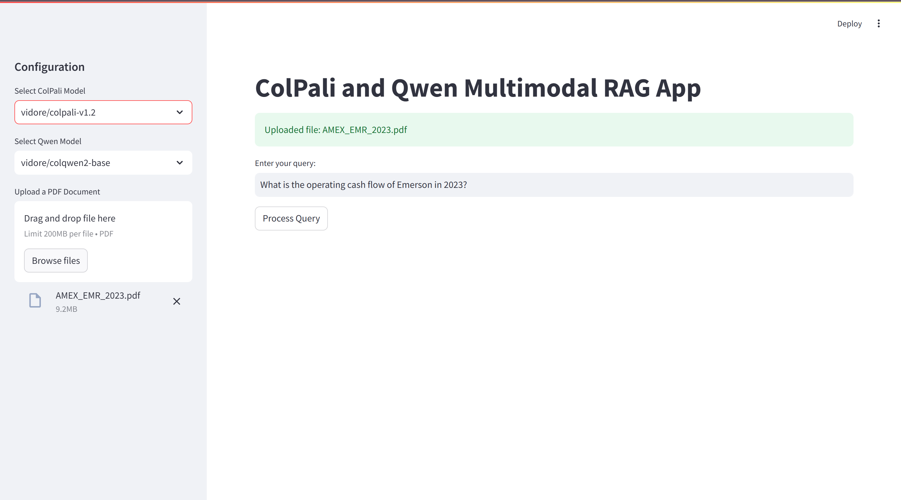

# OpenFinanceAI


Open-source project focused on developing a generative AI agent for financial analysis and responsible investment recommendations.

---

[[Dataset]](https://huggingface.co/datasets/artefactory/Argimi-Ardian-Finance-10k-text)

## Table of Contents
- [Overview](#openfinanceai)
- [Project Structure](#project-structure)
- [Usage Instructions](#usage-instructions)
- [Output Files Explained](#output-files-explained)
- [Problems](#actual-problems)
- [Next Steps](#future-directions)
- [Authors](#authors) 

## Project Structure

```plaintext
OpenFinanceAI/

├── data/                           # Dataset provided
├── data_test/                      # Smaller dataset to run to test PDFs
│   ├── ardian_dataset_test.csv     # CSV file for analyzing pipeline performance
├── output/                         # Directory for generated results
│   ├── relevant_documents/         # Stores the top-K most relevant document images
│   ├── similarity_maps/            # Stores similarity map visualizations
│   ├── generated_responses.txt     # Final generated responses
│   ├── similarity_scores.txt       # Similarity scores for each token and document
│   ├── FinQA/                      # Directory for FinQA evaluation results
│       ├── Qwen2VL/                # Results for Qwen2VL model
│       ├── Qwen2_5VL/              # Results for Qwen2_5VL model
│       └── evaluation_results.txt  # Final comparison results
├── streamlit/                      # Directory containing Streamlit application
│   ├── output/                     # Output folder for Streamlit results
│   ├── temp_files/                 # Temporary files generated during Streamlit execution
│   ├── uploaded_pdfs/              # Uploaded PDFs from Streamlit app
│   ├── ardian_dataset_test.csv     # CSV file for analyzing pipeline performance
├── Colpali_Qwen_ResponsePerPage.py # Alternate script for per-page responses (under testing)
├── Colpali_Qwen.py                 # Main script to process PDFs and generate responses with Qwen2-VL-2B-Instruct
├── Colpali_Qwen_2_5.py             # Main script to process PDFs and generate responses with Qwen/Qwen2.5-VL-7B-Instruct
└── eval_finqa.py                   # Evaluating the Visual Language Model
├── README.md                       # Project documentation
└── requirements.txt                # Python dependencies
└── app.py                          # Streamlit Application
```

## Usage Instructions

### GPU Access
To request a GPU session:
```bash
srun -p gpu_inter -t 00:30:00 --pty bash
```
To request a specific GPU node:

```bash
srun -p gpu_inter -t 00:30:00 --nodelist=sh03 --pty bash
```

Execute the main script as follows

```bash
python Colpali_Qwen2_5.py
```
Please note that there is another vesrion that we are testing ```Colpali_Qwen_ResponsePerPage.py``` that generates a response for every single K documents. 

### Retriever Evaluation

To evaluate the retrievers, we followed the official instructions provided in the [Vidore Benchmark Retriever README](https://github.com/illuin-tech/vidore-benchmark/blob/main/src/vidore_benchmark/retrievers/README.md). 

1. Install the required package:
   ```bash
   pip install "vidore-benchmark[all-retrievers]"
   ```
2. Ensure all necessary files are saved manually, as automatic saving is not handled by the process.
3. Install the package in editable mode:
   ```bash
   pip install -e .
   ```
4. Execute the retriever evaluation command:
   ```bash
   vidore-benchmark evaluate-retriever \
       --model-class colqwen2_personal \
       --model-name vidore/colqwen2-v1.0 \
       --dataset-name vidore/docvqa_test_subsampled \
       --split test
   ```

### FinQA Evaluation

In addition to evaluating the retriever, we also assess our model’s performance using [FinQA](https://finqasite.github.io/), which focuses on evaluating the Visual Language Model (VLM) directly rather than retrieval effectiveness. 

1. **Load the dataset** containing questions, answers, and associated PDF documents.
2. **Run the model** on the dataset without retrieval, directly processing the PDF input.
3. **Assess the generated answers** qualitatively to ensure coherence and accuracy.

Since FinQA does not rely on retrieval metrics, the objective is to verify if the model generates meaningful and contextually correct responses from the provided PDFs. This evaluation complements the retriever assessment by testing the end-to-end question-answering capability of our system.


### File Management
Use [WinSCP](https://winscp.net/eng/download.php) for file transfer between local and remote systems.

## Output Files Explained

The output directory contains the following key files and folders:

1. **`relevant_documents/`**
   - **Description**: Contains the top-K most relevant images extracted from the input PDF.
   - **Details**: These images are determined based on similarity scores with the provided query.

2. **`similarity_maps/`**
   - **Description**: Contains visualizations of token similarity maps.
   - **Details**: Each map highlights the most relevant areas of a document for each token in the query.

3. **`generated_responses.txt`**
   - **Description**: A text file containing the final generated responses based on the query.
   - **Details**: Combines information from all top-K relevant images to produce a single, coherent answer.

4. **`similarity_scores.txt`**
   - **Description**: A detailed log of similarity scores for each token in the query and the corresponding document sections.
   - **Format**:
     ```plaintext
     Document 1, Token #1 (`<bos>`): MaxSim score = 0.28
     Document 1, Token #2 (`Query`): MaxSim score = 0.24
     ...
     ```

5. **`FinQA/`**
   - **Description**: Contains the results of the FinQA evaluation.
   - **Details**: This directory includes subfolders with a prompt, target, and generated answer for each sample and for each model evaluated, as well as a final comparison results file.
   - **Subfolders**:
     - **`Qwen2VL/`**: Contains the results for the Qwen2VL model.
     - **`Qwen2_5VL/`**: Contains the results for the Qwen2_5VL model.
     - **`evaluation_results.txt`**: Final comparison results of the models' accuracy.

## Actual problems : 
### 1. Resource Generation Issues with Streamlit Application
This issue arises when multiple jobs are launched simultaneously in the DCE. We successfully ran our code and generated results using Qwen2-VL-2B-Instruct and Qwen/Qwen2.5-VL-7B-Instruct with the scripts `Colpali_Qwen.py` and `Colpali_Qwen2_5.py`. However, we encounter a CUDA out-of-memory error when attempting to use the Streamlit Application.

1. Go to  the [interactive desktop](https://dev.dce-cs.fr/pun/sys/dashboard/batch_connect/sys/bc_desktop/dce/session_contexts/new) from DCE 

2. Ensure all dependencies are installed:
   ```bash
   pip install -r requirements.txt
   ```
3. Run the application:
   ```bash
   streamlit run streamlit_app.py
   ```

Example screenshot of the Streamlit interface:



torch.OutOfMemoryError: CUDA out of memory. Tried to allocate 19.68 GiB. GPU 0 has a total capacity of 23.68 GiB of which 11.88 GiB is free. Including non-PyTorch memory, this process has 11.79 GiB memory in use. Of the allocated memory 11.44 GiB is allocated by PyTorch, and 43.59 MiB is reserved by PyTorch but unallocated. If reserved but unallocated memory is large try setting PYTORCH_CUDA_ALLOC_CONF=expandable_segments:True to avoid fragmentation.  See documentation for Memory Management  (https://pytorch.org/docs/stable/notes/cuda.html#environment-variables)

Same problem with OpenGVLab/InternVL2_5-78B-MPO ("Colpali_InternVL2.5.py") : 

torch.OutOfMemoryError: CUDA out of memory. Tried to allocate 462.00 MiB. GPU 0 has a total capacity of 23.68 GiB of which 161.00 MiB is free. Including non-PyTorch memory, this process has 23.52 GiB memory in use. Of the allocated memory 23.18 GiB is allocated by PyTorch, and 31.53 MiB is reserved by PyTorch but unallocated. If reserved but unallocated memory is large try setting PYTORCH_CUDA_ALLOC_CONF=expandable_segments:True to avoid fragmentation.  See documentation for Memory Management  (https://pytorch.org/docs/stable/notes/cuda.html#environment-variables)
(base) tramonte_luc@sh04:~$ 

## Future Directions

### 2. Enhancing Performance 

**Benchmark Testing:**

- [OpenVLM Leaderboard](https://huggingface.co/spaces/opencompass/open_vlm_leaderboard)

- [Open FinLLM](https://huggingface.co/blog/leaderboard-finbench)

**Implementing a Profiler:**  

- [Profiler](https://huggingface.co/docs/accelerate/en/usage_guides/profiler)

**Fine-tuning:**

- Fine-tune the vision model (Utilize annotated data)
- Implement unsupervised learning techniques on the Ardian Dataset

### 3. Scaling Colpali with Vespa + ameliorating general pipeline
### 4. Finish dataset for performance evaluation 

## Authors
- **Gabriel Trier**  
- **Lucas Tramonte**  
- **Rayane Bouaita**  

